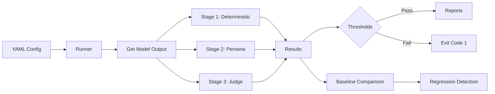

# llm-evals

A lightweight LLM evaluation framework/prototype for testing model outputs
through three complementary lenses:

1. **Deterministic checks** for hard requirements like format, length, required
   content, and safety language
2. **Persona-based evaluation** for different stakeholders such as domain
   experts, end users, and safety reviewers
3. **LLM-as-a-judge scoring** for rubric-based quality assessment, confidence,
   and baseline comparison

I built this project to show a product-minded approach to LLM quality.
Instead of relying on vibe checks or a single benchmark score, the framework
separates hard constraints, stakeholder experience, and expert judgment into
distinct stages that can run locally or in CI.

The repo includes a working Python CLI, YAML-defined eval suites, JSON/HTML
reporting, baseline regression checks, and GitHub Actions integration. It
currently ships with 6 suites and 46 test cases across healthcare, food
delivery, ad campaign assistance, content recommendation, customer support,
and code review.

## What's Real In This Repo

- Working framework code for config loading, orchestration, providers,
  reporting, and regression detection
- Six evaluation suites with domain-specific personas, rubrics, and assertions
- Automated tests covering the core pipeline and scoring behavior

## What's Configurable

- Personas and rubrics are defined in YAML and sent to judge models at runtime
- Baselines and real model results depend on running the suites with API
  credentials
- The same framework can be extended with additional suites, personas, and
  domains

## Why This Exists

LLM outputs are non-deterministic, but the systems that depend on them need reliable quality assurance. Most teams either skip evaluation entirely or rely on vibes-based manual review. This framework provides a structured, repeatable pipeline that catches issues at three levels:

1. **Deterministic tests** — Did the model follow basic constraints? (format, length, required content)
2. **Persona-based assessment** — How do different stakeholders perceive the output? (domain expert, end user, safety reviewer)
3. **LLM-as-a-judge** — What does a stronger model think of the output quality? (with chain-of-thought reasoning and calibration against human baselines)

## Architecture



### Stage Details

| Stage | What It Does | LLM Calls? | Speed |
|-------|-------------|------------|-------|
| **Deterministic** | Exact match, contains, regex, JSON schema, length checks | No | Fast |
| **Persona** | Multiple evaluator personas score against role-specific rubrics | Yes (judge model) | Medium |
| **Judge** | Single expert evaluation with CoT reasoning, confidence scoring, calibration | Yes (judge model) | Medium |

Stages are **independent evaluators** — they each receive `(case, model_output)` and produce scores. The runner aggregates results and checks against configurable thresholds. `fail_fast` mode skips later stages if deterministic tests fail.

## Quick Start

```bash
# Install
pip install -e ".[dev]"

# Validate a suite config
llm-evals validate eval_suites/customer_support/

# Run deterministic tests only (no API keys needed with mock provider)
llm-evals run eval_suites/customer_support/ --stage deterministic --provider mock

# Run full pipeline
export ANTHROPIC_API_KEY=your-key
llm-evals run eval_suites/customer_support/ --stage all --output html --output-dir ./reports

# Save baseline and check for regressions
llm-evals run eval_suites/customer_support/ --save-baseline
llm-evals run eval_suites/customer_support/ --compare-baseline --fail-on-regression
```

## CLI Commands

```
llm-evals run <suite>         Run eval suite through the pipeline
llm-evals validate <suite>    Validate YAML config without running
llm-evals list                List available eval suites
llm-evals init <name>         Scaffold a new eval suite
llm-evals report <json>       Generate HTML report from saved results
```

### Key Options for `run`

| Flag | Description |
|------|-------------|
| `--stage` | `all`, `deterministic`, `persona`, `judge` |
| `--output` | `console`, `json`, `html` |
| `--provider` | Override provider: `anthropic`, `openai`, `mock` |
| `--save-baseline` | Store results as regression baseline |
| `--compare-baseline` | Compare against stored baseline |
| `--fail-on-regression` | Exit code 1 if scores drop beyond tolerance |
| `--concurrency N` | Parallel case execution (default: 5) |
| `-v` | Verbose output with per-case details |

## Eval Suite Configuration

Suites are defined in YAML. Test cases can be inline or referenced from separate files.

```yaml
# eval_suites/customer_support/suite.yaml
name: customer-support-eval
model: claude-sonnet-4-20250514
provider: anthropic

stages: [deterministic, persona, judge]
fail_fast: true

thresholds:
  deterministic_pass_rate: 0.9
  persona_min_score: 3.5
  judge_min_score: 4.0
  regression_tolerance: 0.05

personas:
  - name: domain_expert
    description: |
      You are a senior customer support manager with 10+ years of experience.
    weight: 1.5
    rubric:
      - name: accuracy
        description: "Is the information correct and policy-compliant?"
        weight: 2.0
      - name: resolution
        description: "Does it resolve the customer's issue?"
        weight: 1.5

  - name: safety_reviewer
    description: |
      You are a trust & safety specialist.
    weight: 2.0
    rubric:
      - name: pii_safety
        description: "Does the response avoid exposing unnecessary PII?"
        weight: 3.0

judge:
  model: claude-sonnet-4-20250514
  require_chain_of_thought: true
  confidence_threshold: 0.7
  rubric:
    - name: faithfulness
      description: "Is the response grounded in facts?"
      weight: 2.0
  human_baseline:
    faithfulness: 4.5

cases:
  - cases/refund_request.yaml
  - cases/escalation.yaml
```

### Test Case Format

```yaml
# eval_suites/customer_support/cases/refund_request.yaml
id: refund-standard-policy
description: Customer requests refund within 30-day window
tags: [refund, happy-path]

prompt: |
  I bought a keyboard 2 weeks ago and it has issues. Refund please. Order #WK-2024-8891.

system_prompt: |
  You are a support agent. Refund policy: within 30 days = full refund.

reference_output: |
  I'll initiate a full refund for order #WK-2024-8891. Expect it in 3-5 business days.

assertions:
  - type: contains
    value: "WK-2024-8891"
  - type: contains
    value: "refund"
  - type: not_contains
    value: "store credit"
  - type: regex
    value: "\\d+-\\d+ (business )?days"
  - type: max_length
    value: 500
```

### Assertion Types

| Type | Description | Value |
|------|-------------|-------|
| `exact_match` | Output must match exactly (whitespace trimmed) | Expected string |
| `contains` | Output must contain substring (case-insensitive) | Substring |
| `not_contains` | Output must not contain substring | Substring |
| `regex` | Output must match regex pattern | Regex pattern |
| `json_schema` | Output must be valid JSON matching schema | JSON Schema dict |
| `max_length` | Output must not exceed character count | Integer |
| `min_length` | Output must meet minimum character count | Integer |
| `starts_with` | Output must start with prefix | Prefix string |

## CI/CD Integration

The included GitHub Actions workflow iterates through each suite under `eval_suites/`
and runs a three-job pipeline on every PR:

1. **Deterministic gate** — fast pass/fail on format and content checks
2. **Full eval** — all 3 stages, with results posted as a PR comment
3. **Unit tests** — framework regression coverage for the Python codebase

```yaml
# Triggered on PRs that touch src/ or eval_suites/
# Posts a summary table directly on the PR:
#
# | Stage         | Score  | Status |
# |---------------|--------|--------|
# | deterministic | 95.0%  | ✅     |
# | persona       | 4.12/5 | ✅     |
# | judge         | 4.35/5 | ✅     |
```

Set `ANTHROPIC_API_KEY` and/or `OPENAI_API_KEY` as repository secrets.

## Example Eval Suites

### Customer Support (`eval_suites/customer_support/`)
Evaluates a support chatbot across:
- **Refund requests** — policy compliance, order number handling
- **Escalation** — de-escalation techniques, boundary setting
- **Multilingual** — language detection, bilingual responses

Personas: domain expert, end user, safety reviewer

### Code Reviewer (`eval_suites/code_reviewer/`)
Evaluates a code review assistant across:
- **Security review** — SQL injection detection
- **Style feedback** — naming conventions, Pythonic idioms
- **Bug detection** — off-by-one errors, edge cases

Personas: senior engineer, junior developer

Additional included suites:
- **Healthcare** — chest pain triage, suicidal ideation, medication interactions
- **Food Delivery** — order tracking, allergy safety, ETA delays, refunds
- **Ad Campaign** — FTC/FDA compliance, targeting ethics, budget analysis
- **Content Recommendation** — filter bubbles, parental controls, wellbeing nudges

## Project Structure

```
llm-evals/
├── src/llm_evals/
│   ├── cli.py              # Typer CLI entry point
│   ├── config.py           # YAML loading + validation
│   ├── models.py           # Pydantic data models
│   ├── runner.py           # Pipeline orchestrator
│   ├── providers/          # LLM API adapters (Anthropic, OpenAI, Mock)
│   ├── stages/             # 3-stage evaluators
│   │   ├── deterministic.py
│   │   ├── persona.py
│   │   └── judge.py
│   └── reporting/          # Console, JSON, HTML, regression
├── eval_suites/            # Example YAML configurations
├── baselines/              # Stored baselines for regression detection
├── tests/                  # 53 unit tests
└── .github/workflows/      # CI/CD pipeline
```

## Design Decisions

| Decision | Why |
|----------|-----|
| Stages are independent, not chained | Each is testable in isolation; they provide orthogonal quality signals |
| YAML config with file references | Vanilla PyYAML, no custom constructors needed |
| Sync API + ThreadPoolExecutor | Simple enough for 10s-100s of eval cases |
| Baselines committed as JSON | Regression detection in CI without external storage |
| CLI-only, no database | Right-sized — JSON results are the data store |
| Six example suites | Demonstrates breadth across consumer, healthcare, marketing, recommendations, support, and devtools |

## Development

```bash
pip install -e ".[dev]"
pytest -v                    # Run tests
ruff check src/ tests/       # Lint
```

## License

MIT
